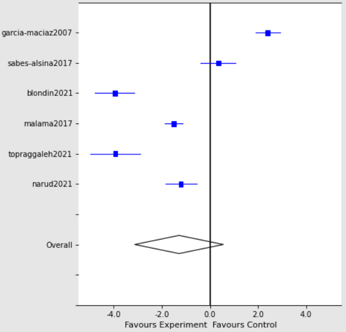

# Python Meta Analysis

This project provides an implementation of SPSS-like meta-analysis with random effects in Python, using the PythonMeta library. The code is capable of performing necessary calculations given mean and standard deviation values and parameters. It supports both manual input and file import. The project can plot a random effect forest plot and an effect size graph using PythonMeta tools.


## Run Locally

To run the code, you need to use a Python script in the command line that takes two arguments: a list of studies and a dictionary of settings. The studies argument is a list of strings containing data for each study, including ID, mean and standard deviation values, and the number of participants in both experimental and control groups. The settings argument is a dictionary that includes keys for the data type, statistical models, algorithm, and effect size calculation method.

The main() function uses the PythonMeta library to initialize three classes: Data(), Meta(), and Fig(). Data() imports the study data and sets the data type, Meta() performs the meta-analysis, sets the subgroup, data type, models, algorithm, and effect size calculation method, and Fig() plots the forest plot and effect size graph. To display the study data and the results of the meta-analysis, the showstudies() and showresults() functions are used, respectively.

First, you can clone the repository:

```bash
  git clone https://link-to-project
```

Then install PythonMeta:

```bash
  pip install PythonMeta
```

Run the script with input in the following format:

```bash
python meta_analysis.py ["study1 data", "study2 data"] '{"datatype": "cont", "models": "fixed", "algorithm": "DL", "effect": "SMD"}'
```


